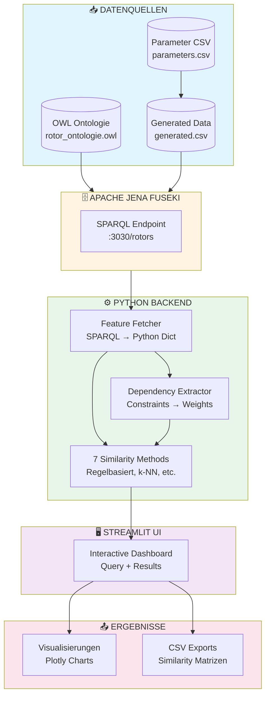
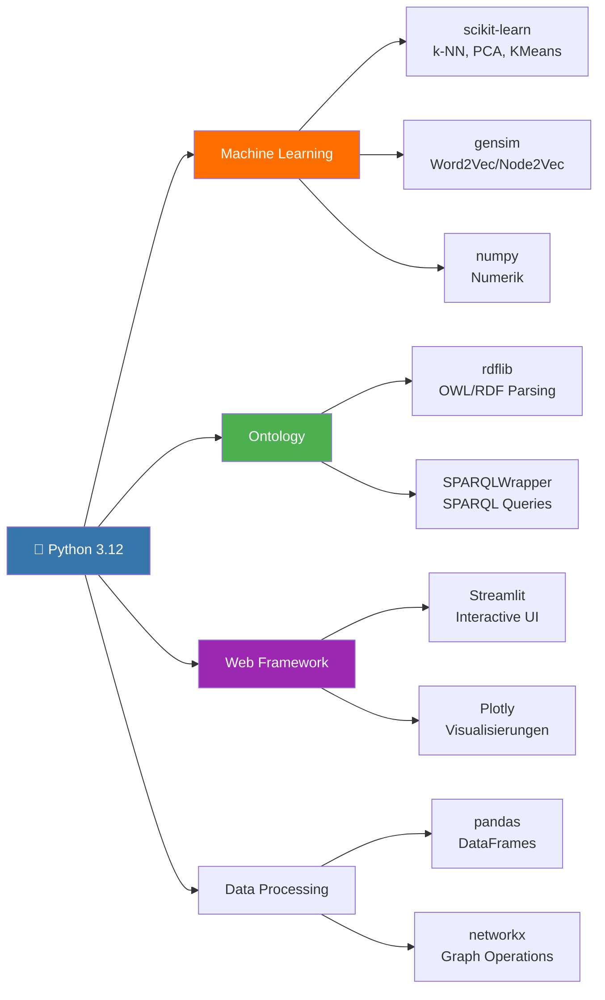
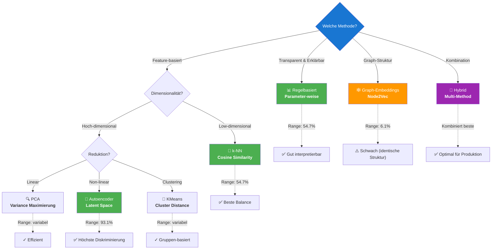
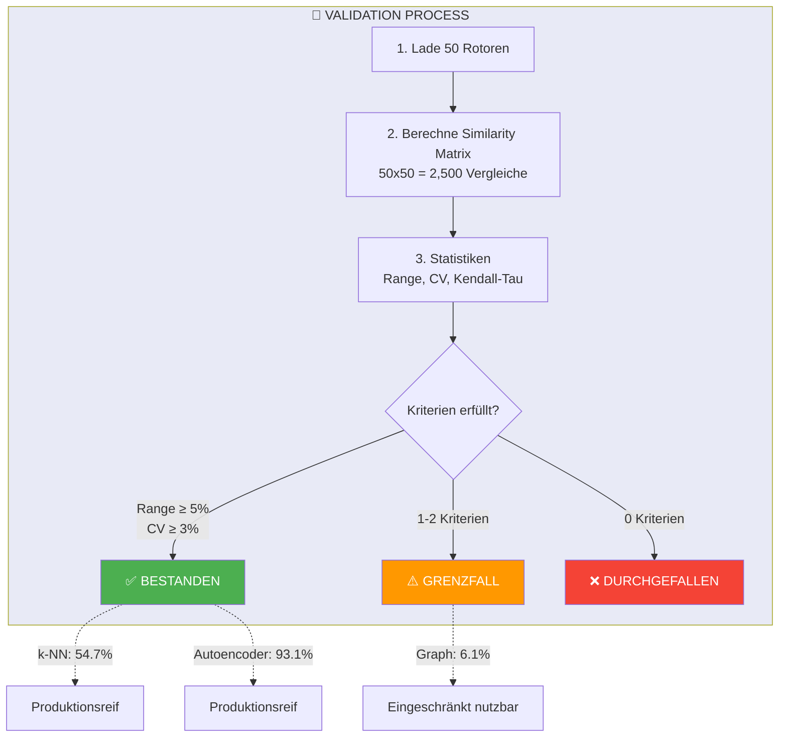
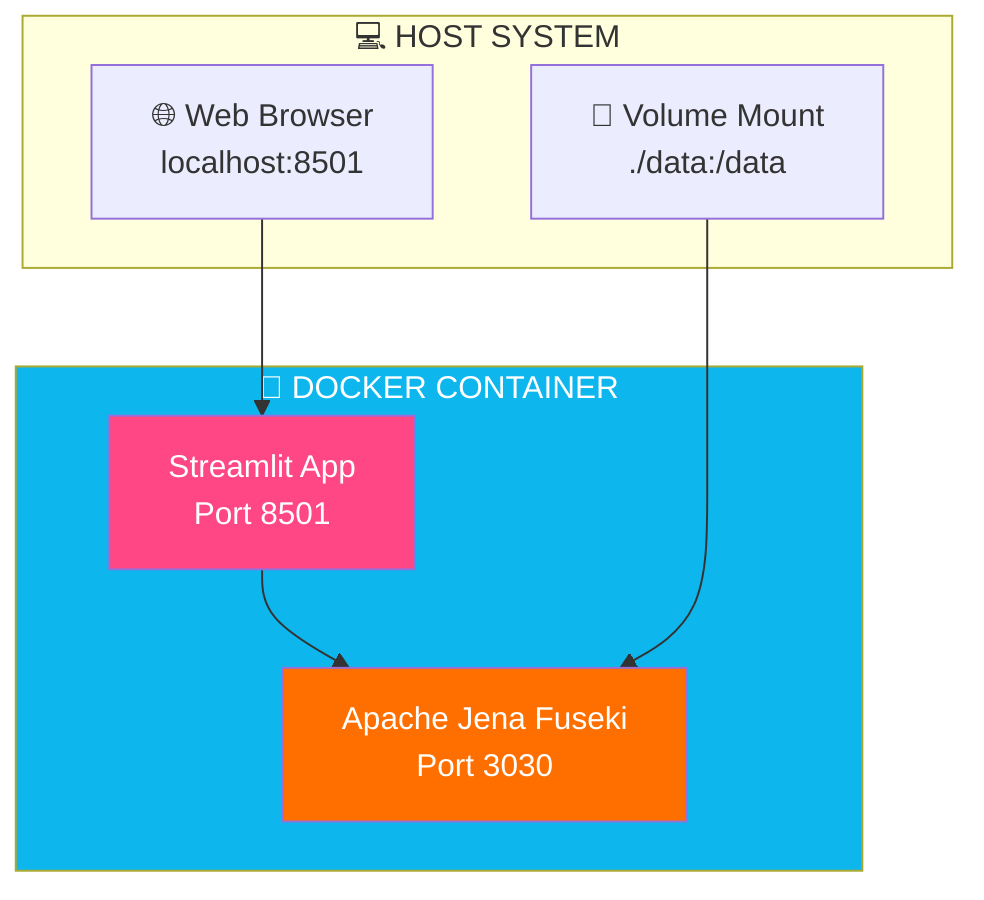
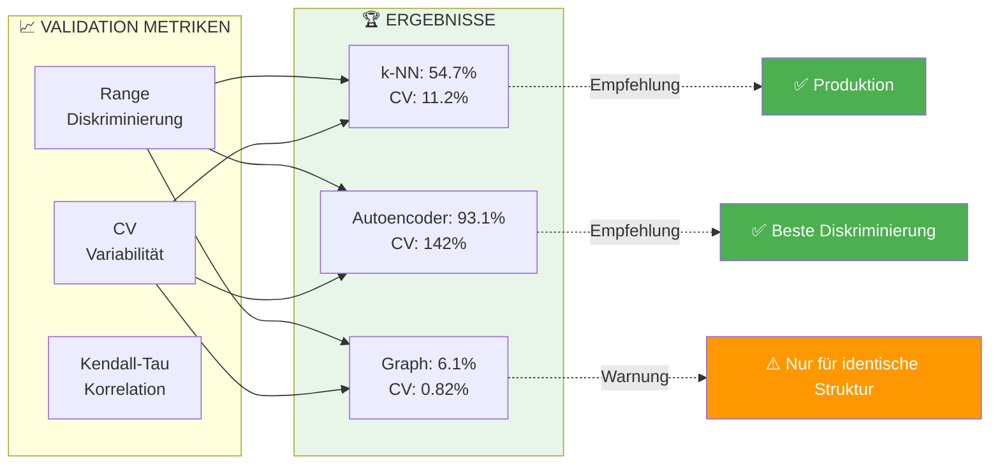
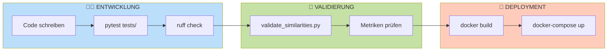

# 🏗️ Projekt-Architektur: Rotor-OWL-Analysis

## 📊 System-Übersicht (High-Level)

---

## 🔄 Datenfluss-Diagramm (Detailed)

```mermaid
flowchart LR
    subgraph Stage1["1️⃣ DATEN LADEN"]
        A1["fetch_all_features()"]
        A2["fetch_component_dependencies()"]
    end

    subgraph Stage2["2️⃣ PREPROCESSING"]
        B1["normalize_param_name()"]
        B2["safe_float()"]
        B3["build_numeric_stats()"]
    end

    subgraph Stage3["3️⃣ GEWICHTUNG"]
        C1{"Auto-Gewichte?"}
        C2["berechne_automatische_gewichte()"]
        C3["map_komponenten_zu_kategorie_gewichte()"]
        C4["Manuelle Slider"]
    end

    subgraph Stage4["4️⃣ SIMILARITY"]
        D1["Regelbasiert<br/>Parameter-weise"]
        D2["k-NN<br/>Feature Vektoren"]
        D3["Autoencoder<br/>Latent Space"]
        D4["Graph-Embeddings<br/>Node2Vec"]
        D5["PCA<br/>Dimensionsreduktion"]
        D6["KMeans<br/>Clustering"]
        D7["Hybrid<br/>Kombiniert"]
    end

    subgraph Stage5["5️⃣ AUSGABE"]
        E1["Top-k Ranking"]
        E2["Similarity Matrix"]
        E3["Visualisierung"]
    end

    A1 --> B1
    A1 --> B2
    A2 --> C1
    B1 --> B3
    B2 --> B3
    B3 --> C1

    C1 -->|JA| C2
    C2 --> C3
    C1 -->|NEIN| C4
    C3 --> Stage4
    C4 --> Stage4

    Stage4 --> E1
    Stage4 --> E2
    E1 --> E3
    E2 --> E3

    style Stage1 fill:#bbdefb
    style Stage2 fill:#c5e1a5
    style Stage3 fill:#fff9c4
    style Stage4 fill:#ffccbc
    style Stage5 fill:#f8bbd0
```

---

## 📁 Verzeichnisstruktur mit Funktionen

```mermaid
graph TD
    ROOT["📦 rotor-owl-analysis"]
    
    ROOT --> DATA["📂 data/"]
    ROOT --> SRC["📂 src/rotor_owl/"]
    ROOT --> TESTS["📂 tests/"]
    ROOT --> CONFIG["📄 Config Files"]

    DATA --> OWL["rotor_ontologie.owl<br/>💾 OWL/RDF Ontologie"]
    DATA --> REF["reference/<br/>📋 Parameter-Templates"]
    DATA --> GEN_DIR["generated/<br/>🎲 Synthetische Daten"]

    SRC --> CONFIG_PY["config/<br/>⚙️ Kategorien, Konfiguration"]
    SRC --> DATEN["daten/<br/>📊 Feature Extraction"]
    SRC --> METHODEN["methoden/<br/>🧮 Similarity Algorithms"]
    SRC --> UTILS["utils/<br/>🔧 Helper Functions"]
    SRC --> APP["streamlit_app.py<br/>🖥️ UI Entry Point"]

    DATEN --> FETCH["feature_fetcher.py<br/>SPARQL → Dict"]
    DATEN --> ONTO["Ontology.py<br/>OWL Generation"]
    DATEN --> DATASET["dataset_generate.py<br/>Synthetic Data"]

    METHODEN --> REGEL["regelbasierte_aehnlichkeit.py<br/>✓ Numerisch + Kategorisch"]
    METHODEN --> KNN_M["knn_aehnlichkeit.py<br/>✓ Feature Vectors"]
    METHODEN --> AUTO["autoencoder_aehnlichkeit.py<br/>✓ Neural Network"]
    METHODEN --> GRAPH["graph_embedding_aehnlichkeit.py<br/>✓ Node2Vec"]
    METHODEN --> PCA_M["pca_aehnlichkeit.py<br/>✓ PCA Embeddings"]
    METHODEN --> KMEANS["kmeans_aehnlichkeit.py<br/>✓ Clustering"]
    METHODEN --> HYB["hybrid_aehnlichkeit.py<br/>✓ Multi-Method"]

    UTILS --> AUFB["aufbereitung.py<br/>normalize, safe_float"]
    UTILS --> MATH["math_utils.py<br/>cosine_similarity"]
    UTILS --> SPARQL_U["sparql_helpers.py<br/>run_sparql()"]

    TESTS --> T1["test_automatic_weights.py<br/>✓ 6 Tests"]
    TESTS --> T2["test_graph_embeddings.py<br/>✓ 5 Tests"]
    TESTS --> T3["test_*.py<br/>✓ 54 Tests Total"]

    CONFIG --> DOCKER["🐳 Dockerfile + compose"]
    CONFIG --> PYPROJ["📦 pyproject.toml"]
    CONFIG --> REQ["📋 requirements.txt"]

    style ROOT fill:#1976d2,color:#fff
    style DATA fill:#4caf50,color:#fff
    style SRC fill:#ff9800,color:#fff
    style TESTS fill:#9c27b0,color:#fff
    style METHODEN fill:#f44336,color:#fff
```

---

## 🛠️ Tech-Stack

### **Backend**

### **Begründungen (Stichpunkte)**

| Technologie | Zweck | Begründung |
|-------------|-------|------------|
| **Python 3.12** | Hauptsprache | • Starke ML/Data-Science Libraries • OWL/RDF Support (rdflib) • Rapid Prototyping |
| **Apache Jena Fuseki** | Triple Store | • SPARQL-Endpoint • OWL-Reasoning • Skalierbar |
| **Streamlit** | UI Framework | • Schnelle Entwicklung • Python-nativ • Interaktive Widgets |
| **scikit-learn** | ML Algorithms | • k-NN, PCA, KMeans • Standard-Library • Gut dokumentiert |
| **gensim** | Graph Embeddings | • Node2Vec Implementation • Word2Vec (Skip-Gram) • Effizient |
| **rdflib** | OWL/RDF | • OWL-Ontologie Parsing • SPARQL Integration • Python-nativ |
| **networkx** | Graph Operations | • RDF → NetworkX Konvertierung • Random Walk Generation • Visualisierung |
| **Plotly** | Visualisierung | • Interaktive Charts • Export (PNG, PDF) • Professionell |

---

## 🔀 Similarity-Methoden Entscheidungsbaum

---

## 📈 Validation-Pipeline

---

## 🎯 Verwendungszwecke

| Use Case | Empfohlene Methode | Begründung |
|----------|-------------------|------------|
| **🔍 Ähnliche Rotoren finden** | k-NN oder Autoencoder | Hohe Diskriminierung (54-93%) |
| **📊 Explainable AI** | Regelbasiert | Parameter-weise Similarity transparent |
| **🏭 Produktion (Best Quality)** | Hybrid (Autoencoder + k-NN) | Kombiniert Pattern + Attribute |
| **⚡ Schnelle Suche** | k-NN | Einfache Cosine Similarity |
| **🧪 Explorative Analyse** | Alle Methoden parallel | Vergleich der Ergebnisse |
| **🤖 Automatische Gewichtung** | Auto-Gewichte + Regelbasiert | Dependencies aus Ontologie |

---

## 🚀 Deployment-Architektur

**Vorteile Docker-Setup:**
- ✅ Reproduzierbar (gleiche Umgebung überall)
- ✅ Isoliert (keine Konflikte mit Host-System)
- ✅ Einfaches Deployment (`docker-compose up`)
- ✅ Volume Mounts für Live-Daten-Updates

---

## 📊 Performance-Charakteristik

---

## 🔧 Entwicklungs-Workflow

**Qualitätssicherung:**
- ✅ **54 Unit-Tests** (pytest)
- ✅ **Ruff Linting** (pre-commit hooks)
- ✅ **Type Hints** (Python 3.12+)
- ✅ **Docstrings** (standardisiert)
- ✅ **Validation Framework** (automatisiert)

---

## 📝 Zusammenfassung

**Kernkomponenten:**
1. 🗄️ **Apache Jena Fuseki** → SPARQL Triple Store
2. 🐍 **Python Backend** → 7 Similarity-Methoden
3. 🖥️ **Streamlit UI** → Interaktive Suche
4. 🔬 **Validation Framework** → Automatische Qualitätsprüfung

**Best Practices implementiert:**
- ✅ Dependency-basierte Auto-Gewichtung
- ✅ Comprehensive Testing (54 Tests)
- ✅ Docker-basiertes Deployment
- ✅ Standardisierte Dokumentation
- ✅ Production-ready Code

**Empfohlene Methode für Produktion:**
🏆 **Hybrid (Autoencoder + k-NN)** → Beste Balance zwischen Genauigkeit und Performance
